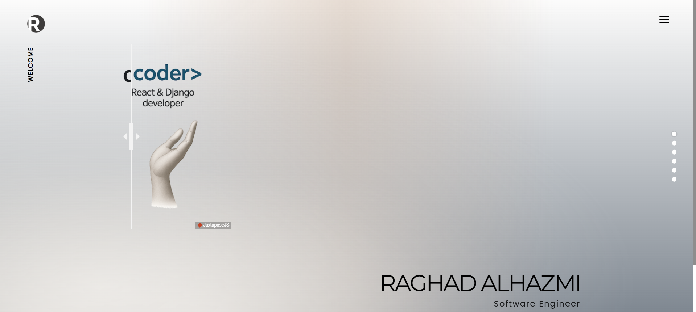
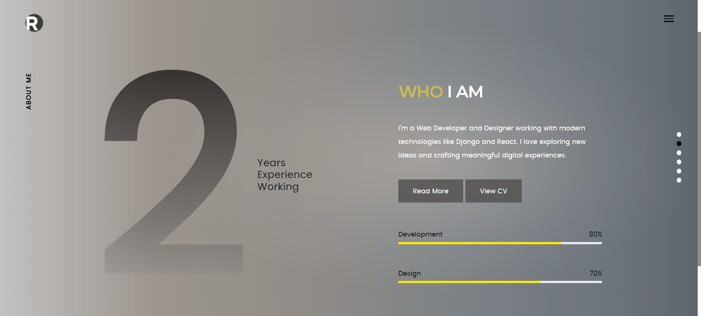
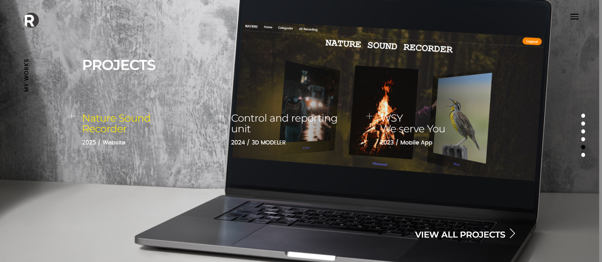
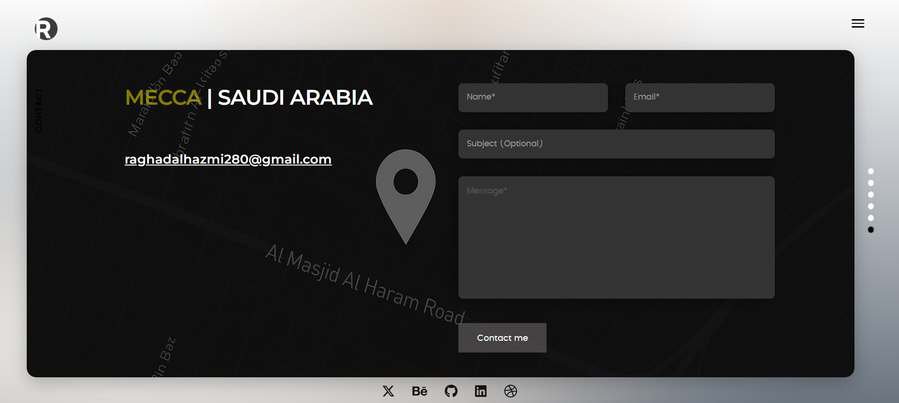

# Portfolio

##  Description
A personal portfolio website showcasing my projects, skills, and background as a programmer and UI designer.

---

## Why was it built?
This website was built to present my work in a clean and organized way, highlight my technical and design skills, and serve as a professional online presence.

---

##  Technologies Used
- HTML5
- CSS3

---

##  Features
- Easy scrolling pages
- Modern and clean design
- Creative background
- Responsive layout

---

##  Project Pages
- 
- 
- 
- 